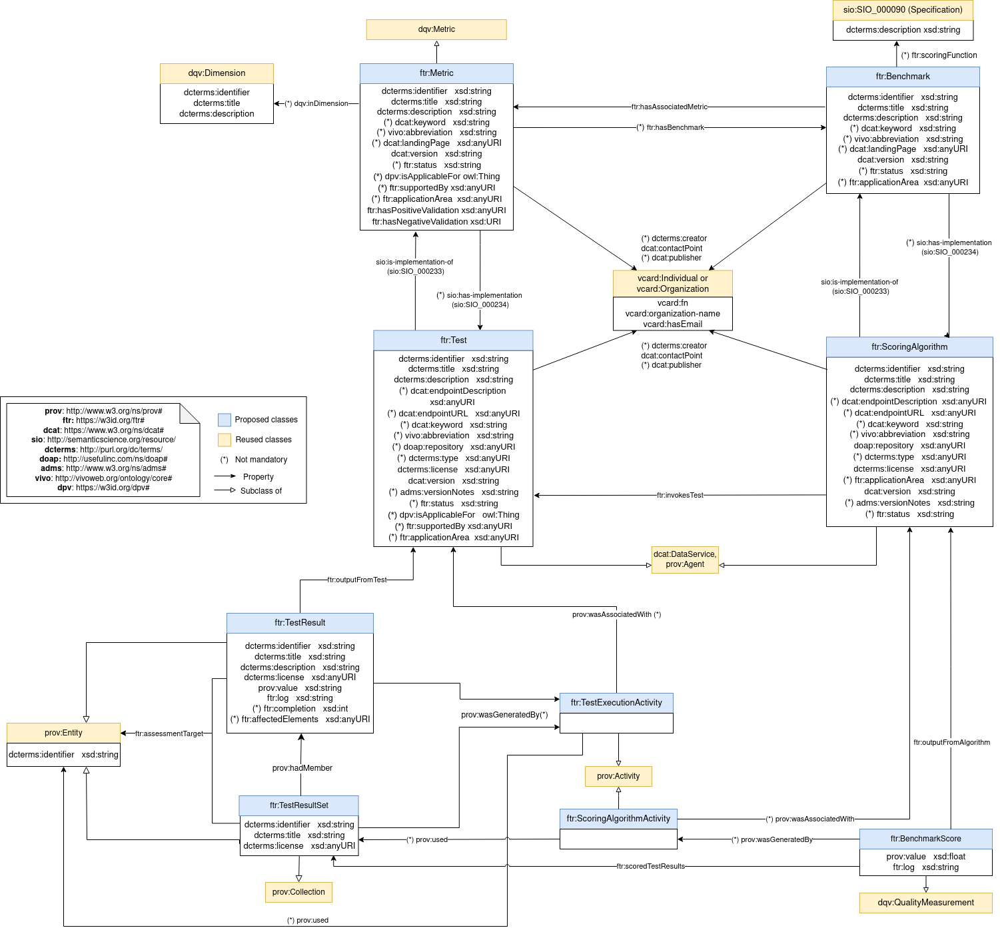

# FAIR Testing Resource Vocabulary (FTR)
 

Repository to track the requirements and specifications of FAIR assessment reports.

**Permanent identifier:** [https://w3id.org/ftr#](https://w3id.org/ftr#) (click to see documentation and examples)

**Authors**:  Daniel Garijo, Mark Wilkinson, Pablo Alarcón, Rober Huber, Lukas Arnhold, Allyson Lister, Elli Papadopoulou, Leonidas Pispiringas, Neil Chue Hong, Clement Jonquet, Wim Hugo

**Source document**: [https://docs.google.com/document/d/1HusredfHgymRg2ub4L0GnVSRV8IWZvFJyMkE6POejpc/edit?usp=sharing](https://docs.google.com/document/d/1HusredfHgymRg2ub4L0GnVSRV8IWZvFJyMkE6POejpc/edit?usp=sharing), with contributions from an initial modeling by Robert Huber and a [diagram](https://owncloud.tuwien.ac.at/index.php/s/VaGxqnf5MxfDtzz#/files_mediaviewer/dmp-dqv.png) authored by Lukas Arnhold.

**Ongoing document**: [Assessment components glossary and description](https://docs.google.com/document/d/1_dFj5bi6JKlcGZt40BEzVWUg6NjG1CBzGnCWAaad6NU/edit?usp=sharing) and [Metadata elements for FAIR assessment](https://docs.google.com/spreadsheets/d/1QKOoy-YJLNgnQywe6wOTTCBqCg0YuRWmIT-xFoB3ZCo/edit?usp=sharing)

## Core test result representation
We distinguish the following main concepts:
- **TestResult**: Output of running a test over a resource. A test result also should contain provenance metadata about the process followed to create it. `TestResult`is represented as an extension of `prov:Entity`. A test result points to the corresponding test through the `ftr:outputFromTest` property.
- **TestResultSet**: A set of FAIR test results, together with their respective metadata. Common metadata may describe the set. For example, if all results where run by a request to the same API.
- **Test**: Service, formed by an API and associated piece of code that implements a Metric, and is executed (by a FAIR assessment tool), retrieving a particular and standardised result.
- **TestExecutionActivity**: The action carried out by an agent of calling an API in which a test (or set of tests) were run. The result of this activity is either a `TestResult` or a `TestResultSet`.
- **Metric**: Narrative domain-agnostic description that a Test must wholly implement.
- **Benchmark**: Benchmarks are community-specific groupings of a set of Metrics that provides a narrative of those particular ways in which that community defines FAIR for assessment purposes.
- **ScoringAlgorithm**: Piece of code that contextualises the sum of all test results for a given benchmark, into a final quantitative assessment result. 
- **BenchmarkScore**: Score obtained after executing a scoring algorithm over a set of test results. The benchmark score includes a value, a log and a link to the test results used to obtain the score.

## Examples
Please see the [latest specification draft for examples](https://w3id.org/ftr#desc). The FTR specification has been implemented through two different implementations: 
- Champion: https://tools.ostrails.eu/champion 
- FOOPS!: https://w3id.org/foops (see API [here](https://w3id.org/foops/api))

## Context
If you want to use JSON-LD serializations to implement FTR, we recommend using the [ftr contex](https://w3id.org/ftr/context). It will help you making your JSON-LD documents easier to read (see some [examples](https://w3id.org/ftr#desc) in the specification too). 

## OpenAPI template
If you want to implement a REST API following the FTR specification, you may use the [OpenAPI template](https://github.com/OSTrails/FAIR_testing_resource_vocabulary/blob/main/development/api/open_api_description.yaml) provided in this repository. See [an example implementation](https://w3id.org/foops/api))

## Requirements
The proposed vocabulary is derived from a set of competency questions, available at the `cqs` folder. CQs come from:
* Requirements based on the experience of the authors (as FAIR assessment tool developers)
* The [open document](https://docs.google.com/document/d/1HusredfHgymRg2ub4L0GnVSRV8IWZvFJyMkE6POejpc/edit?usp=sharing) where experts from various projects regarding FAIR assessment have gathered.