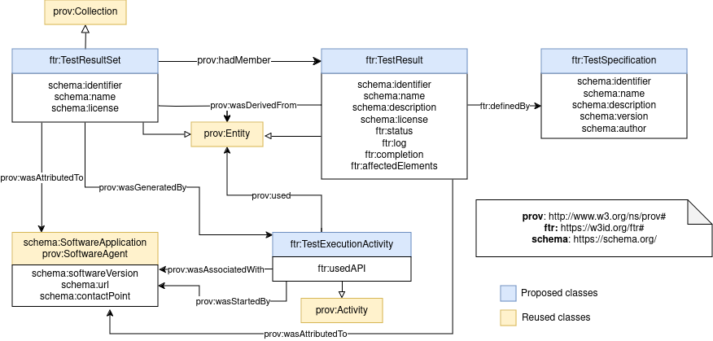

# FAIR_assessment_output_specification
[](https://www.repostatus.org/#wip) (work in progress)

Repository to track the requirements and specifications of FAIR assessment reports.

**Permanent identifier:** [https://w3id.org/ftr#](https://w3id.org/ftr#) (click to see documentation and examples beyond the README file)

**Authors**:  Daniel Garijo, Mark Wilkinson, Rober Huber, Lukas Arnhold, Allyson Lister, Elli Papadopoulou, Leonidas Pispiringas, Neil Chue Hong, Clement Jonquet, Wim Hugo

**Source document**: [https://docs.google.com/document/d/1HusredfHgymRg2ub4L0GnVSRV8IWZvFJyMkE6POejpc/edit?usp=sharing](https://docs.google.com/document/d/1HusredfHgymRg2ub4L0GnVSRV8IWZvFJyMkE6POejpc/edit?usp=sharing), with contributions from an initial modeling by Robert Huber and a [diagram](https://owncloud.tuwien.ac.at/index.php/s/VaGxqnf5MxfDtzz#/files_mediaviewer/dmp-dqv.png) authored by Lukas Arnhold.


## Core test result representation
We distinguish four main concepts:
- **TestResult**: Output of running a test over a resource. A test result also should contain provenance metadata about the process followed to create it. `TestResult`is represented as an extension of `prov:Entity`. A test result points to the corresponding test specification through the `ftr:definedBy` property.
- **TestSpecification:** A specification stating what a test should do. 
- **TestResultSet**: A set of FAIR test results, together with their respective metadata. Common metadata may describe the set. For example, if all results where run by a request to the same API.
- **TestExecutionActivity**: The action carried out by an agent of calling an API in which a test (or set of tests) were run. The result of this activity is either a `TestResult` or a `TestResultSet`.



### Example: Describing a single test result

Test results have basic metadata to understand which test did they run, an explanation and whether they passes or not (or whether they were completed to a certain extend, if applicable). Below a test result is run on a resource `ex:assessedResource` and it passes. A log and a human readable description are returned.

```
@prefix prov: <http://www.w3.org/ns/prov#> .
@prefix ftr: <https://w3id.org/fair_test_result#> .
@prefix schema: <https://schema.org/> .
@prefix ex: <http://example.org/fair/> .
@prefix xsd: <http://www.w3.org/2001/XMLSchema#> .

ex:result1 a ftr:TestResult;
    schema:identifier "id";
    schema:name "Result of test for checking if HTML version of the resource is reachable";
    ftr:isDefinedBy <http://example.org/foops/test/12>; #assuming this URL will have a specification of the test
    schema:description "A HTML version of this resource was found";
    ftr:log """
        LOG indicating the operations undertaken goes here
        """;
    prov:wasDerivedFrom ex:assessedResource; 
    prov:generatedAtTime "DATE"^^xsd:dateTime;
    ftr:status "pass".

ex:assessedResource a prov:Entity;
    schema:url "https://w3id.org/example".
```

### Example: Grouping test results in a test set
Many assessment tools run a set of tests (e.g., organized under a test collection), and they may share common provenance metadata. In those cases, we propose a flexible approach by using a test set to record their provenance information. For example, let us have two tests from an assessment service run over a single resource:

```
@prefix prov: <http://www.w3.org/ns/prov#> .
@prefix ftr: <https://w3id.org/fair_test_result#> .
@prefix schema: <https://schema.org/> .
@prefix ex: <http://example.org/fair/> .
@prefix xsd: <http://www.w3.org/2001/XMLSchema#> .

ex:result1 a ftr:TestResult;
    schema:identifier "long_random_id";
    schema:name "Result of test for checking if HTML representation of the resource is reachable";
    ftr:isDefinedBy <http://example.org/foops/test/12>; #assuming this URL will have a specification of the test
    schema:description "A HTML representation of this resource was found";
    ftr:log """
        LOG indicating the operations undertaken goes here
        """;
    ftr:status "pass".

ex:result2 a ftr:TestResult;
    schema:identifier "long_random_id";
    schema:name "Result of test for checking if an RDF representation of the resource is reachable";
    ftr:isDefinedBy <http://example.org/foops/test/15>; #assuming this URL will have a specification of the test
    schema:description "An RDF representation of this resource was found";
    ftr:log """
        LOG indicating the operations undertaken goes here
        """; 
    ftr:status "fail".

ex:testResultSet1 a ex:TestResultSet;
    prov:wasGeneratedBy ex:foopsExecution123;
    prov:used ex:assessedResource;
    prov:wasDerivedFrom ex:assessedResource;
    prov:hadMember ex:result1, result2 .

ex:assessedResource a prov:Entity;
    schema:url "https://w3id.org/example".

ex:foopsExecution123 a ftr:TestExecutionActivity;
    prov:used ex:assessedResource;
    ftr:usedAPI "https://foops.linkeddata.es/assessOntology/"^^xsd:anyURI;
    prov:wasStartedBy [
        a prov:Agent;
        schema:identifier <ORCID_ID>;
        schema:name "Daniel".
    ];
    prov:startedAtTime "DATE"^^xsd:dateTime;
    prov:endedAtTime "DATE"^^xsd:dateTime.

ex:foops a schema:SoftwareApplication;
    schema:url "https://w3id.org/foops"^^xsd:anyURI;
    schema:softwareVersion "0.1.0".
```

## Scope
So far, the next release aims to represent test **results**. Future releases will address:
- Test specification metadata (i.e., the test from which a test 
result is derived from)
- What a quality metric is, and its prpovenance. For example, how two tests results may be used to generate a quality metric.
- How a FAIR assessment score is calculated (e.g., how different quality metrics are aggregated together) 
- How tests are supposed incorporate suggestions, and which metadata should they include.


## Requirements
The proposed vocabulary is derived from a set of competency questions, available at the `cqs` folder. CQs come from:
* Requirements based on the experience of the authors (as FAIR assessment tool developers)
* The [open document](https://docs.google.com/document/d/1HusredfHgymRg2ub4L0GnVSRV8IWZvFJyMkE6POejpc/edit?usp=sharing) where experts from various projects regarding FAIR assessment have gathered.