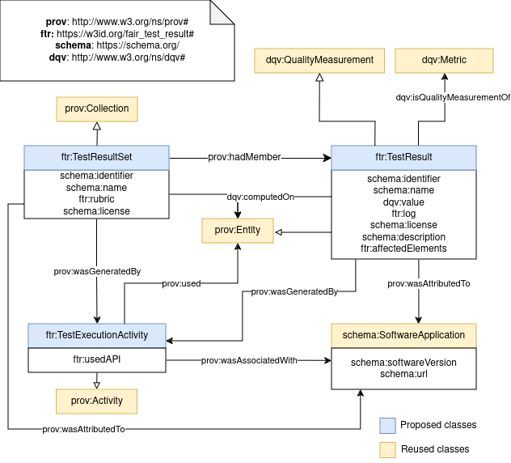

# FAIR_assessment_output_specification
Repository to track the requirements and specifications of FAIR assessment reports

The current diagram being discussed is available below:

**This is work in progress.** 

Competency questions are available at `cqs` with the requirements gathered to represent test resutls.